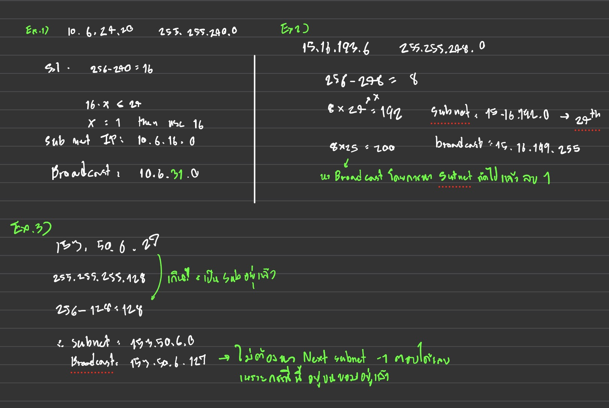

# CNI-CMDs-NOTE

> This is for me na krub no share

##  List of Contents

- Subnet Calculation  
- Basic Router & Switch Commands  
- VLAN Configuration  
- Inter-VLAN Routing  
- Static Routing  
- DHCP  
- ACL  
- HTTP / HTTPS Server  
- NAT (Static, Dynamic, PAT)  
- DNS Server  

## Subnet calculation


## Basic commands for Router & Switch configuration
```
conf t
enable secret class
line console 0
exec-timeout 0 0 
logging synchronous 
exit
ip domain-name itkmitl.lab 
ip ssh version 2 
crypto key generate rsa modulus 2048
username admin privilege 15 secret cisco
line vty 0 15
login local
transport input telnet ssh
exec-timeout 0 0 
logging synchronous
exit
do wr
```

## VLAN configuration
```
en
conf t
int vlan 8
ip add 10.x.x.x 255.255.255.0
no shut
exit
int Gi0/1
switchport mode access
switchport access vlan 8
no shutdown
```

## Inter VLAN 
### Trunk port
- After create VLANs first link to router
```
interface Gi0/0
 description UPLINK_TO_ROUTER
 switchport trunk encapsulation dot1q
 switchport mode trunk
 switchport trunk allowed vlan 8,9
 no shutdown
 exit
```
- Second, do configure between switch
```
interface range Gi0/3 - 4
 description LINK_TO_SWITCH2
 switchport trunk encapsulation dot1q
 switchport mode trunk
 switchport trunk allowed vlan 8,9
 no shutdown
 end
```
### Router (The Stick)
- Prepare the Physical Interface 
```
interface Gi0/0
 no shutdown
 no ip address
 exit
```
- Create Sub-Interface for VLAN 8, 9 
```
interface Gi0/0.8-Gi0.9
 encapsulation dot1q 8-9    <-- This number '8' MUST match the VLAN ID
 ip address 192.168.10.1 255.255.255.0
 exit
```

## Static Routing
```
ip route <dest network> <dest subnet>
```

## DHCP
- Create Pool for each network
```
ip dhcp pool LEFT_NET
 network 192.168.10.0 255.255.255.0
 default-router 192.168.10.1
 dns-server 8.8.8.8
 exit
```
- Exclude the Gateway IPs so they aren't given to PCs
```
ip dhcp excluded-address 192.168.10.1
```
- Exclude IP addresses with range. For this example router will allocate the IP addresses 192.168.10.50 - 192.168.10.254
```
ip dhcp excluded-address 192.168.10.1 192.168.10.49
```

## ACL
### First define rules
- Block ICMP echo, Telnet, SSH, HTTP
```
access-list 100 deny icmp host <PC1_IP> host <PC3_IP> echo
access-list 100 deny tcp host 172.24.10.1 host 192.168.10.3 eq 23
access-list 100 deny tcp host 172.24.10.1 host 192.168.10.3 eq 22
access-list 100 deny tcp host 172.24.10.1 host 192.168.10.3 eq 80
```
- Don't forget to
```
access-list 100 permit ip any any
```
- Apply rules to interface
```
interface Gi0/0
 ip access-group 100 in
```

## HTTP server
### Swtich & Router
- HTTP
```
ip http server
ip http authentication local
```
- HTTPS
```
ip http secure-server
```


## NAT
### Static NAT
- Define "Inside" and "Outside" Interfaces
```
interface Gi0/0
 ip nat inside
 exit

interface Gi0/2
 ip nat outside
 exit
```
- Create the Static Mapping
```
! Syntax: ip nat inside source static <LOCAL_IP> <PUBLIC_IP>
ip nat inside source static 172.24.10.2 192.168.122.50
```
- Don't forget to create the route
```
ip route 0.0.0.0 0.0.0.0 <PUBLIC IP HOP>
```
- For verification
```
show ip nat translations
```
### Dynamic NAT
Steps:
1. Define inside and outside interfaces
2. Create an Access List
```
! Syntax: access-list <number> permit <source_network> <wildcard_mask>
access-list 1 permit 172.24.10.0 0.0.0.255
```
3. Create the NAT Pool
```
! Syntax: ip nat pool <POOL_NAME> <START_IP> <END_IP> netmask <MASK>
ip nat pool PUBLIC_POOL 192.168.122.50 192.168.122.60 netmask 255.255.255.0
```
4. Link Them Together
```
! Syntax: ip nat inside source list <ACL_NUM> pool <POOL_NAME>
ip nat inside source list 1 pool PUBLIC_POOL
```

## PAT
Remove the old NAT rule first if it exists in running-config.
- Change from linking with pool to interface instead.
```
! Syntax: ip nat inside source list <ACL> interface <OUTSIDE_INT> overload
ip nat inside source list 1 interface Gi0/2 overload
```

## DNS Server
- Enable the DNS Server Service at Router
```
ip dns server
ip domain-name mylab.local
ip name-server 8.8.8.8
```
- Create the phonebook on router, so you can ping them by name!
```
ip host PC1 172.24.10.2
ip host PC2 172.24.10.3
ip host PC3 192.168.10.3
ip host PC4 192.168.10.4
ip host Router1 172.24.10.1
ip host Router2 192.168.10.1
```
- Update DHCP to use the Router as DNS
```
! --- Find your DHCP Pool Name ---
! (Use 'do show run | sec dhcp' if you forgot the name)
ip dhcp pool LEFT_NET   <-- Use your actual pool name here

! --- Change the DNS Server to Router-1's IP ---
dns-server 172.24.10.1
```