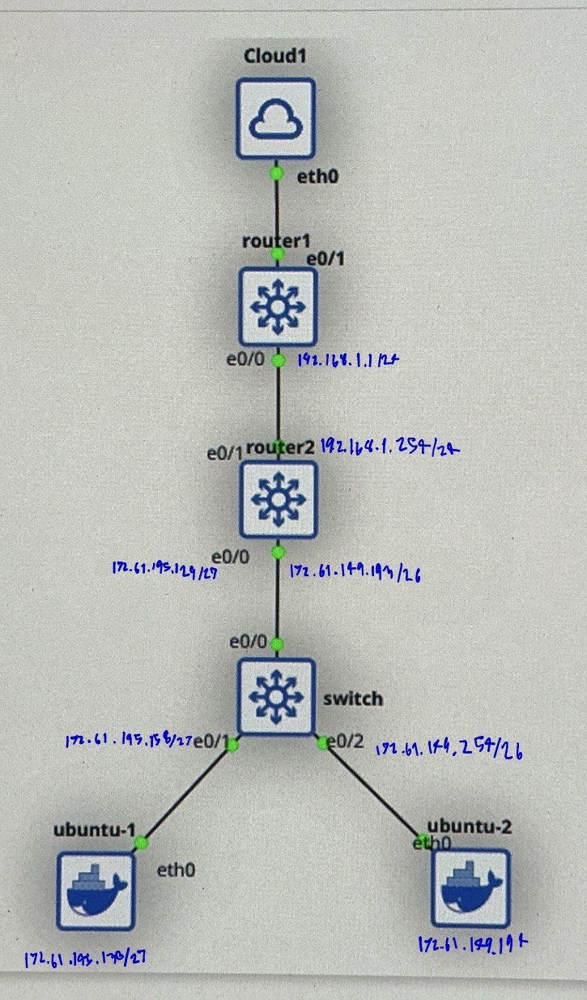

# CNI-MOCK-EXAM
>Mock exam commands and configurations

## Topology

## Part 2: Basic connectivity
### Switch
Create Vlan A, B
```
int vlan 195, 149
ip add ... ...
exit

int E0/1 E0/2
no shut
switchport mode access
switchport access vlan 195, 149
```
Create Trunk link
```
int E0/0
no shut
switchport trunk encapsulation dot1q
switch port mode trunk
```

### Router1
Add static ip
```
int e0/0
ip add ... ...
no shut
```
DHCP
```
ip dhcp pool VLANB_POOL
network ... ...
default-router ... ...
dns-server .. ...
exit

ip dhcp excluded-address ... ...
```

NAT
```
----Define inside and outside -----
int e0/0
ip nat inside
no shut
exit

int e0/1
ip add dhcp
no shut
ip nat outside

----Create rule -----
access-list 10 permit any

----Create NAT by using an interface to the clould -----
ip nat inside source list 10 interface Ethernet0/1 overload
```

### Router2
Create sub-interface 
```
int e0/0.195 .149
no shut
encapsulation dot1q <vlan id>
ip add ... ...
ip helper-address ... --> For DHCP relay
```
Add ip add to another interfaces
```
int e0/1
ip add ... ...
no shut
```

Do ip route to Internet
```
ip route 0.0.0.0 0.0.0.0 192.168.1.1
```

## Part3: Services
- เปิด DNS Service ที่ Router1 และทำให้ ubuntu1 สามารถ Ping Switch ด้วยชื่อ SW.itkmitl.lab ได้ ตั้งค่า DNS ที่ Router1 และให้ ubuntu2 ให้สามารถ curl ไปที่ WebServer IP 10.70.38.253 ด้วย http://web.itkmitl.lab ได้
### Router1
เปิด DNS Service ที่ Router1 และทำให้ ubuntu1 สามารถ Ping Switch ด้วยชื่อ SW.itkmitl.lab ได้
```
ip dns server
ip domain-lookup
ip host SW.itkmitl.lab 172.61.195.158
ip host web.itkmitl.lab 10.70.38.253
exit
```
ที่ Ubuntu 1 ต้องตั้งค่า DNS Server ให้ชี้มาที่ Router 1 ก่อน
```
echo "nameserver 192.168.1.1" | sudo tee /etc/resolv.conf
```

- เปิด TFTP Service ที่ ubuntu1 และให้ Backup running-config ของ Router1 มาเก็บที่ ubuntu1
### Ubuntu1
TFTP Service
Install program
```
sudo apt-get update
sudo apt-get install tftpd-hpa -y
```
Create a directory to store file
```
sudo mkdir -p /srv/tftp
sudo chmod 777 /srv/tftp
sudo touch /srv/tftp/router1-confg
sudo chmod 777 /srv/tftp/router1-confg
```
Check and restart
```
cat /etc/default/tftpd-hpa
sudo service tftpd-hpa restart
```
### Router1
Backup at router1
```
copy running-config tftp:
! Remote host: 172.61.195.130
! Filename: router1-confg
```

- เปิด Telnet Service ที่ Switch และให้ ubuntu2 สามารถ Telnet มาที่ Switch ได้
### Switch
```
enable secret cisco
line vty 0 4
 password cisco
 login
 transport input telnet
 exit
```
Verify
```
Ubuntu 2: telnet 172.61.195.158
password: cisco
```
- ใช้คำสั่ง Curl จาก ubuntu1 ไปที่ Internet เช่น www.google.com สำเร็จ โดยให้ตั้งค่า Router2 Relay DNS ไปที่ Public DNS Server เช่น 8.8.8.8
### Router2
```
ip dns server
ip domain-lookup
ip name-server 8.8.8.8
exit
```
เปลี่ยน DNS ที่ Ubuntu 1 เพื่อให้แน่ใจว่าใช้ Router 2 เป็นตัว Relay ให้แก้ DNS Server ที่ Ubuntu 1 ชี้ไปที่ Router 2
```
Ubuntu 1: echo "nameserver 172.61.195.129" | sudo tee /etc/resolv.conf
```
Important!!! อย่าลืม map dns ใหม่ ถ้าจำเป็น
```
Router2: ip host SW.itkmitl.lab 172.61.195.158
Router2: ip host web.itkmitl.lab 10.70.38.253
```

## Part4: Security
- ไม่อนุญาตให้ ubuntu2 Telnet มาที่ Switch ได้ แต่เครื่องอื่นๆ (รวม Router1, Router2, ubuntu1) ต้อง Telnet มาได้ทั้งหมด ด้วย IPv4
```
access-list 10 deny 172.61.149.192 0.0.0.63
access-list 10 permit any
line vty 0 4
 access-class 10 in
 exit
```

- ไม่อนุญาตให้ ubuntu2 Ping IPv4 มาที่ ubuntu1 ได้ แต่ให้ ubuntu1 Ping IPv4 มาที่ ubuntu2 ได้ โดยการตั้ง ACL ที่ Router2
```
ip access-list extended 100
 deny icmp 172.61.149.192 0.0.0.63 host 172.61.195.130 echo
 permit ip any any
interface Ethernet0/0.149
 ip access-group 100 in
exit
```